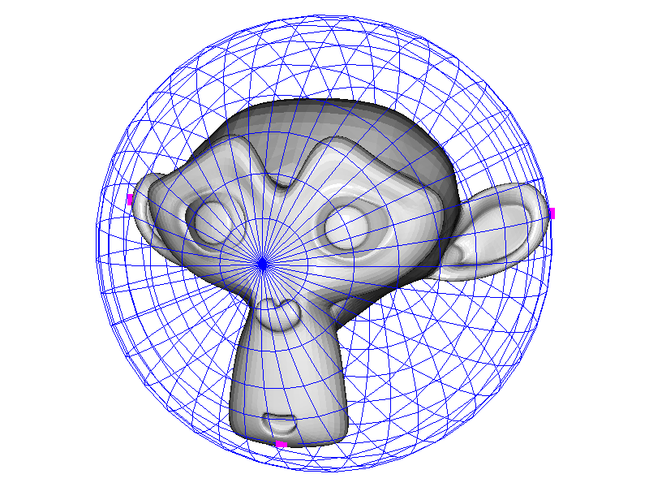
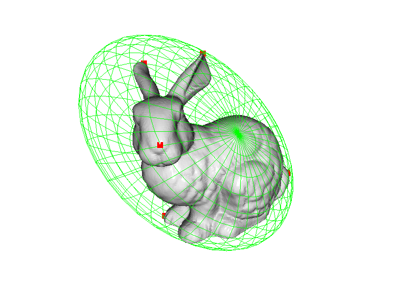
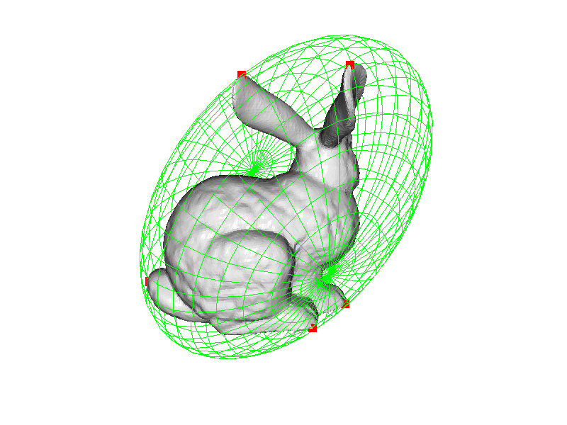
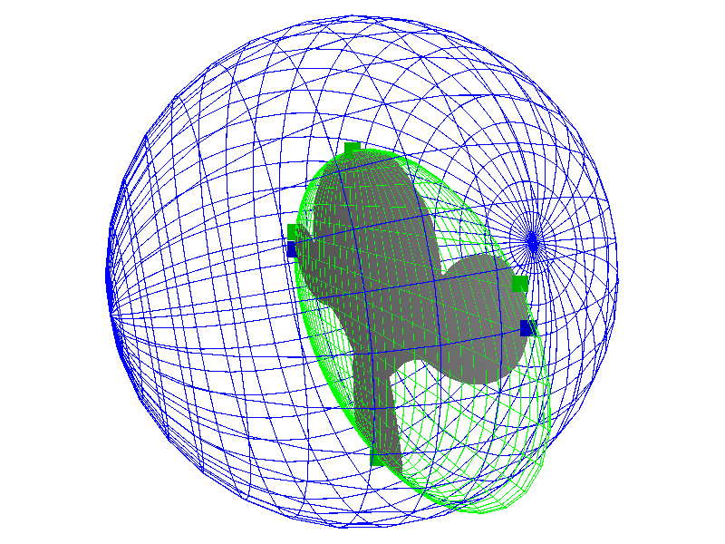

# GeometryND

A lightweight Python package for fitting and bounding **n-dimensional spheres and ellipsoids**.

The package provides tools for:

- Exact minimum enclosing spheres in arbitrary dimensions (Welzl's algorithm)
- Minimum-volume enclosing ellipsoids (Khachiyan's algorithm)
- Automatic handling of degenerate point clouds (collinear, coplanar, lower-dimensional affine subspaces)

---

## Features

### SphereND

Specialized n-dimensional sphere implementation.

Supports:

- Exact minimum enclosing sphere
- Boundary-point identification
- Collinear and lower-dimensional point sets
- Surface-area and volume calculations

### EllipsoidND

General n-dimensional ellipsoid implementation.

Supports:

- Minimum-volume enclosing ellipsoid
- Least-squares ellipsoid fitting (todo)
- RANSAC fitting for noisy data (todo)
- Principal-axis extraction
- Volume calculation
- Residual computation

### Automatic Subspace Detection

The package automatically detects when points lie in a lower-dimensional affine subspace and projects the problem to the intrinsic dimension before solving.

Examples:

| Point Set | Intrinsic Dimension |
|------------|------------|
| Single point | 0 |
| Line | 1 |
| Plane | 2 |
| Volume | 3+ |

This allows robust handling of:

- Collinear points
- Coplanar points
- Hyperplanes in higher dimensions

---

## Quick Start

### Minimum Enclosing Sphere

```python
import numpy as np
from geometryND import SphereND

pts = np.random.rand(100, 3)

sphere, boundary_pts = SphereND.minimum_enclosing(pts)

print("Center:", sphere.center)
print("Radius:", sphere.radius)
```

---

### Minimum Enclosing Ellipsoid

```python
import numpy as np
from geometryND import EllipsoidND

pts = np.random.rand(100, 3)

ellipsoid, boundary_pts = EllipsoidND.minimum_enclosing(pts)

print("Center:", ellipsoid.center)
print("Radii:", ellipsoid.radii)
```

---

### Best-Fit Ellipsoid (todo)

```python
import numpy as np
from geometryND import EllipsoidND

pts = np.random.rand(500, 3)

ellipsoid = EllipsoidND.best_fit(pts)

print(ellipsoid.center)
print(ellipsoid.radii)
```

---

### Robust Ellipsoid Fit Using RANSAC (todo)

```python
import numpy as np
from geometryND import EllipsoidND

pts = np.random.rand(500, 3)

ellipsoid = EllipsoidND.from_points_ransac(
    pts,
    max_iter=100,
    tol=1e-3
)

print(ellipsoid.center)
```

---

## Working with Ellipsoids

### Principal Axes

```python
axes = ellipsoid.axes
```

Returns eigenvectors describing the principal directions.

### Radii

```python
radii = ellipsoid.radii
```

Returns semi-axis lengths.

### Volume

```python
volume = ellipsoid.volume
```

Returns the n-dimensional volume.

### Residuals

```python
residuals = ellipsoid.get_residuals(points)
```

Residual definition:

```text
(x - c)ᵀ A (x - c) - 1
```

Values near zero lie on the ellipsoid boundary.

---

## Working with Spheres

### Radius

```python
sphere.radius
```

### Surface Area

```python
sphere.surface_area
```

### Volume

Inherited from `EllipsoidND`:

```python
sphere.volume
```

### Residuals

```python
sphere.get_residuals(points)
```

Residual definition:

```text
||x - c||² - r²
```

---

## Mathematical Definitions

### Ellipsoid

An ellipsoid is represented as

```text
(x - c)ᵀ A (x - c) = 1
```

where:

- `c` is the center
- `A` is a symmetric positive-definite shape matrix

The semi-axis lengths are:

```text
rᵢ = 1 / √λᵢ
```

where `λᵢ` are the eigenvalues of `A`.

### Sphere

A sphere is treated as a special case:

```text
A = I / r²
```

where all semi-axis lengths are equal.

---

## Algorithms

### Minimum Enclosing Sphere

Uses:

- Welzl's randomized algorithm
- Convex hull reduction
- Recursive exact circumsphere fitting




### Minimum Enclosing Ellipsoid

Uses:

- Khachiyan's algorithm
- Convex hull preprocessing
- Weight-based boundary-point extraction




### Best-Fit Ellipsoid (todo)

Uses:

- Linear least-squares fitting
- Automatic affine-subspace detection

### Robust Fitting (todo)

Uses:

- RANSAC sampling
- Residual-based inlier detection

---

## Requirements

- Python ≥ 3.9
- NumPy
- SciPy

```bash
pip install numpy scipy
```

---
## Example: Lower-dimensional subspace - degenerate data
```python
import numpy as np
import open3d as o3d

from geometryND import SphereND, EllipsoidND
from examples.utils import shape_to_lineset

if __name__ == "__main__":

    project_to_xy_plane = True  # Set to True to project the mesh onto the XY plane

    dataset = o3d.data.MonkeyModel()

    mesh = o3d.io.read_triangle_mesh(dataset.path)
    points = np.asarray(mesh.vertices)
    points[:, 2] = 0   # set all z-values to zero
    mesh.vertices = o3d.utility.Vector3dVector(points)
    mesh.compute_vertex_normals()

    pymbe, mbe_boundary = EllipsoidND.minimum_enclosing(points)
    pymbs, mbs_boundary = SphereND.minimum_enclosing(points)

    mbe_ls = shape_to_lineset(pymbe, resolution=20, colour=(0,1,0))
    mbs_ls = shape_to_lineset(pymbs, resolution=20, colour=(0,0,1))

    mbe_boundary = np.asarray(mbe_boundary)
    mbs_boundary = np.asarray(mbs_boundary)

    mbe_pts = o3d.geometry.PointCloud()
    mbe_pts.points = o3d.utility.Vector3dVector(mbe_boundary)
    mbe_pts.paint_uniform_color((0,0.7,0))

    mbs_pts = o3d.geometry.PointCloud()
    mbs_pts.points = o3d.utility.Vector3dVector(mbs_boundary)
    mbs_pts.paint_uniform_color((0,0,0.7))

    o3d.visualization.draw_geometries([mesh, mbe_ls, mbe_pts, mbs_ls, mbs_pts],
                                      window_name="Bounding Ellipsoid/Sphere", width=800, height=600)
```

The package automatically projects the points into their intrinsic 2D subspace, computes the solution, then lifts the result back into 3D.



---

## Example: High-Dimensional Sphere (untested)

```python
import numpy as np
from geometryND import SphereND

pts = np.random.randn(1000, 10)

sphere, boundary = SphereND.minimum_enclosing(pts)

print("Dimension:", sphere.n)
print("Radius:", sphere.radius)
```

---

## License

MIT License

